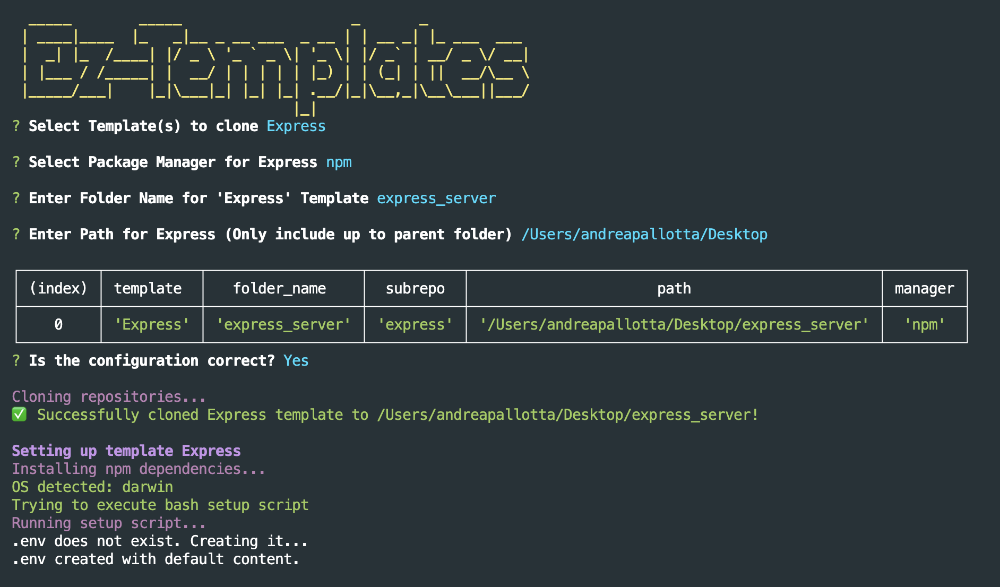

<h1 align="center">Welcome to ez-templates 👋</h1>


<p>
  <a href="https://www.npmjs.com/package/ez-templates" target="_blank">
    
  </a>
  <a href="https://github.com/AndreaPallotta/EzWebTemplate#readme" target="_blank">
    
  </a>
  <a href="https://github.com/AndreaPallotta/EzWebTemplate/graphs/commit-activity" target="_blank">
    
  </a>
  <a href="https://github.com/AndreaPallotta/EzWebTemplate/blob/master/LICENSE.md" target="_blank">
    
  </a>
  <a href="https://github.com/AndreaPallotta/ez-templates/issues" target="_blank">
    
  </a>
  
  
</p>

> A simple npx command to install custom-made web templates

---

<br />

### 🏠 [Homepage](https://github.com/AndreaPallotta/EzWebTemplate#readme)

## Install

```sh
npm install ez-templates -g
# or
npm install ezp -g
```

## Usage

```sh
ezp
# or
npx ez-templates
```

---

<br />

## Preview



---

<br />

## Available templates

All available templates are public and can be found in this [repo](https://github.com/AndreaPallotta/Templates)

- Express JS
- Socket.IO
- React JS (MUI included)
- Elixir
- Rust (Axum)

---

<br />

## Author

👤 **Andrea Pallotta**

- Github: [@AndreaPallotta](https://github.com/AndreaPallotta)

> For inquiries, suggestions, and criticisms, you can reach me via:
>
> - email: [andreapallotta.dev@gmail.com](mailto:andreapallotta.dev@gmail.com)
> - LinkedIn: [@andreapallotta9](https://linkedin.com/in/andreapallotta9)

---

<br />

## 🤝 Contributing

Contributions, issues and feature requests are welcome!<br />Feel free to check [issues page](https://github.com/AndreaPallotta/EzWebTemplate/issues).

If you have your own template repository, I suggest to clone this tool and change the source repository!

---

<br />

## Show your support

This is my first npm package and I believe there is still
much to improve.
<br />
Give a ⭐️ if you found this tool useful or interesting!

---

<br />

## 📝 License

Copyright © 2022 [Andrea Pallotta](https://github.com/AndreaPallotta).<br />
This project is [MIT](https://github.com/AndreaPallotta/EzWebTemplate/blob/master/LICENSE) licensed.
